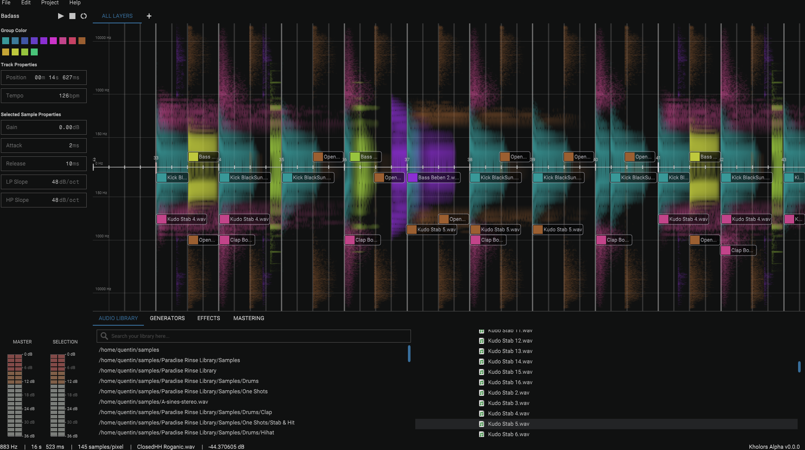

# Kholors
Audio workstation without tracks and where all
imported samples are sharing the same on screen spectrum editor.
You can make track with it by importing samples, and save the
projects a git projects. See [this demo on YouTube](https://www.youtube.com/watch?v=TeF4ExiSIbU).



The use case is to make surgical mixdowns for electronic music. Only works on Linux.

It has been discontinued in favor of a full rewrite that will try to learn from the lessons
of this project, and will focus on:
- Exposing an API of the engine, and making an HTTP bridge for plugin creation and scripting.
- Rewriting a GUI that uses the said api (not through HTTP though).
- Writing OpenAPI specs for everyone to play around with the DAW.
- Leveling up the testing game.
- Using code that can be compiled on Windows (no more syscalls).
- Focusing on handling large imports of stems from other DAWs, including but not only, a process to compress the audio files on spot and trim away all the silences, as well as caching high fidely data on disk for for exports.
- Better configuration and logging utilities, addressing some flaw of the previous design like configuration hot reloading and missing log levels and files.

Writing this software took me a little less than one year of hobby time, I expect the rewrite
to take about one year from now on (2023-11-13). I am reusing lots of code, but some parts will still need carefull attention or rewriting, and good testing as well as factoring takes time to get right !

Therefore don't expect updates on the new software anytime soon, or any support for this deprecated one.
Btw if you're using Linux, it's a great utility for visualizing and solving short mixdown problems.
You might run into problems compiling it on a non rolling release distrho with old lib versions.


## Building
Eventually install dependencies first (example is for ArchLinux).
```
sudo pacman -S gcc pkgconfig cmake make alsa-lib freetype2 webkit2gtk git clang yaml-cpp nlohmann-json libgit2 fftw
```

Then build and run.

```bash
mkdir build
cd build
cmake ..
make Kholors
```
# Running
```bash
# watch out, depending on if cmake is setup to include
# debugging build flags, you will get it here or
# in another Kholors_artefacts subfolder
./Kholors_artefacts/Debug/Kholors\ Example
```

## Testing
```bash
# if not already done, run cmake
cmake ..
make
make test
```
